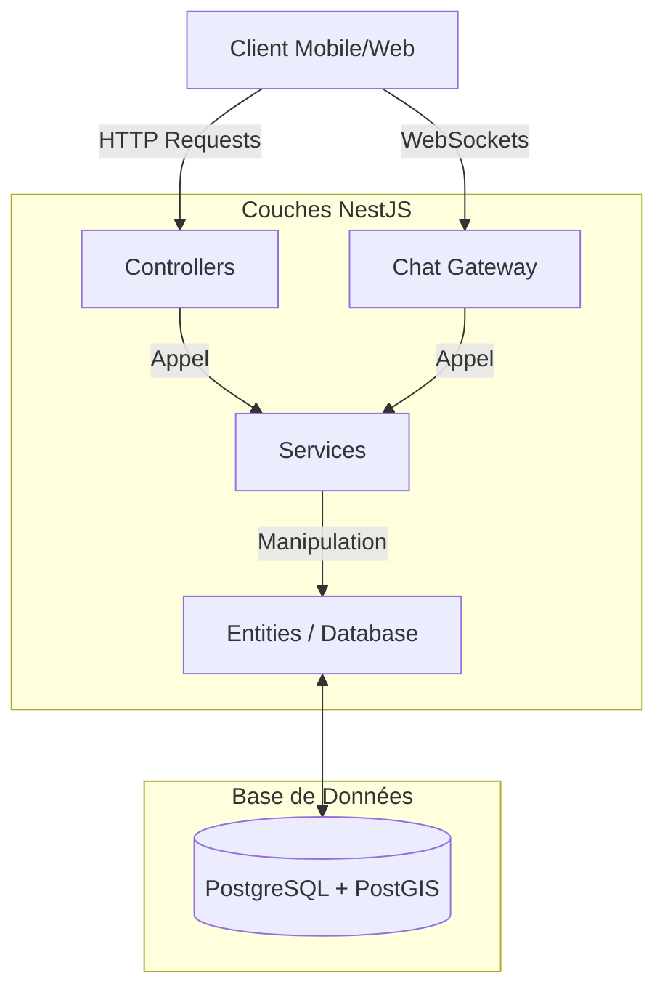

# Architecture et Structure du Backend NearbyChat

Ce document explique en détail l'architecture du backend de **NearbyChat**, construit avec **NestJS**, un framework Node.js progressif.

## 1. Vue d'Ensemble de l'Architecture

L'architecture suit les principes de **NestJS**, qui est fortement inspiré par Angular. Elle est **modulaire**, ce qui signifie que chaque fonctionnalité (Authentification, Chat, Zones, etc.) est isolée dans son propre module.

### Schéma de Fonctionnement Global

### Les Composants Clés
- **Module** : Organise le code en blocs logiques.
- **Controller** : Gère les requêtes HTTP (GET, POST, etc.) et définit les routes.
- **Service** : Contient la logique métier (calculs, base de données).
- **Entity** : Représente la structure des tables en base de données (via TypeORM).
- **DTO (Data Transfer Object)** : Définit la forme des données reçues dans les requêtes.
- **Gateway** : Gère la communication en temps réel via WebSockets.

---

## 2. Analyse Fichier par Fichier (Dossier `src`)

### Fichiers de Configuration Racine
- **main.ts** : Le point d'entrée. Il initialise l'application, configure les outils de validation et lance le serveur sur le port 3000.
- **app.module.ts** : Le "cerveau" de l'application. Il importe tous les autres modules et configure la connexion à la base de données PostgreSQL.

---

### Module `auth` (Authentification)
Gère l'inscription, la connexion et la sécurité.
- **auth.controller.ts** : Définit les routes `/auth/register` et `/auth/login`.
- **auth.service.ts** : Contient la logique pour hacher les mots de passe et générer des tokens JWT.
- **auth.module.ts** : Lie le contrôleur et le service.
- **jwt.strategy.ts** : Définit comment le backend vérifie la validité du token JWT envoyé par le client.
- **jwt-auth.guard.ts** : Un "vigile" qui bloque l'accès aux routes si l'utilisateur n'est pas connecté.

---

### Module `user` (Utilisateurs)
Gère les profils utilisateurs.
- **user.entity.ts** : Définit la table `users` (id, email, password, username).
- **user.service.ts** : Fonctions pour trouver ou créer des utilisateurs en base de données.
- **user.controller.ts** : Routes pour récupérer les informations de l'utilisateur.

---

### Module `zone` (Géolocalisation)
C'est le cœur du concept "Nearby".
- **zone.entity.ts** : Définit les zones géographiques. Utilise **PostGIS** pour stocker des coordonnées GPS.
- **zone.service.ts** : Calcule si un utilisateur est dans une zone ou trouve les zones les plus proches. 
- **zone.controller.ts** : Routes pour créer des zones ou lister celles à proximité.

---

### Module `message` (Messages)
Gère l'historique des discussions.
- **message.entity.ts** : Structure d'un message (texte, auteur, zone, date).
- **message.service.ts** : Enregistre les messages en base et récupère l'historique d'une zone.

---

### Module `chat` (Temps Réel)
Gère la magie de la discussion en direct.
- **chat.gateway.ts** : C'est ici que sont gérés les événements **Socket.io**.
    - `joinZone` : L'utilisateur rejoint une salle virtuelle basée sur sa position.
    - `sendMessage` : Diffuse le message instantanément à tous les autres utilisateurs de la zone.
- **chat.module.ts** : Configure le serveur WebSocket.

---

## 3. Flux de Données Typique

### Exemple : Envoi d'un Message
1. **Client** envoie un événement `sendMessage` via WebSocket à la **ChatGateway**.
2. La **ChatGateway** valide l'utilisateur via son JWT.
3. Elle appelle le **MessageService** pour sauvegarder le message dans PostgreSQL.
4. Elle utilise `server.to(zoneId).emit('newMessage', ...)` pour envoyer le message à tous les gens connectés dans cette zone précise.

## 4. Outils utilisés
- **TypeORM** : Pour parler à la base de données en utilisant du code TypeScript au lieu de SQL pur.
- **Passport/JWT** : Pour la sécurité.
- **Socket.io** : Pour la communication bidirectionnelle ultra-rapide.
- **PostGIS** : Extension de PostgreSQL pour gérer les points GPS et les périmètres circulaires.
